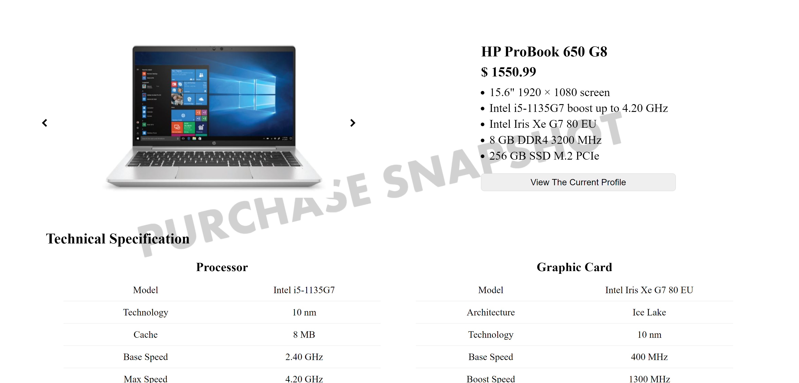
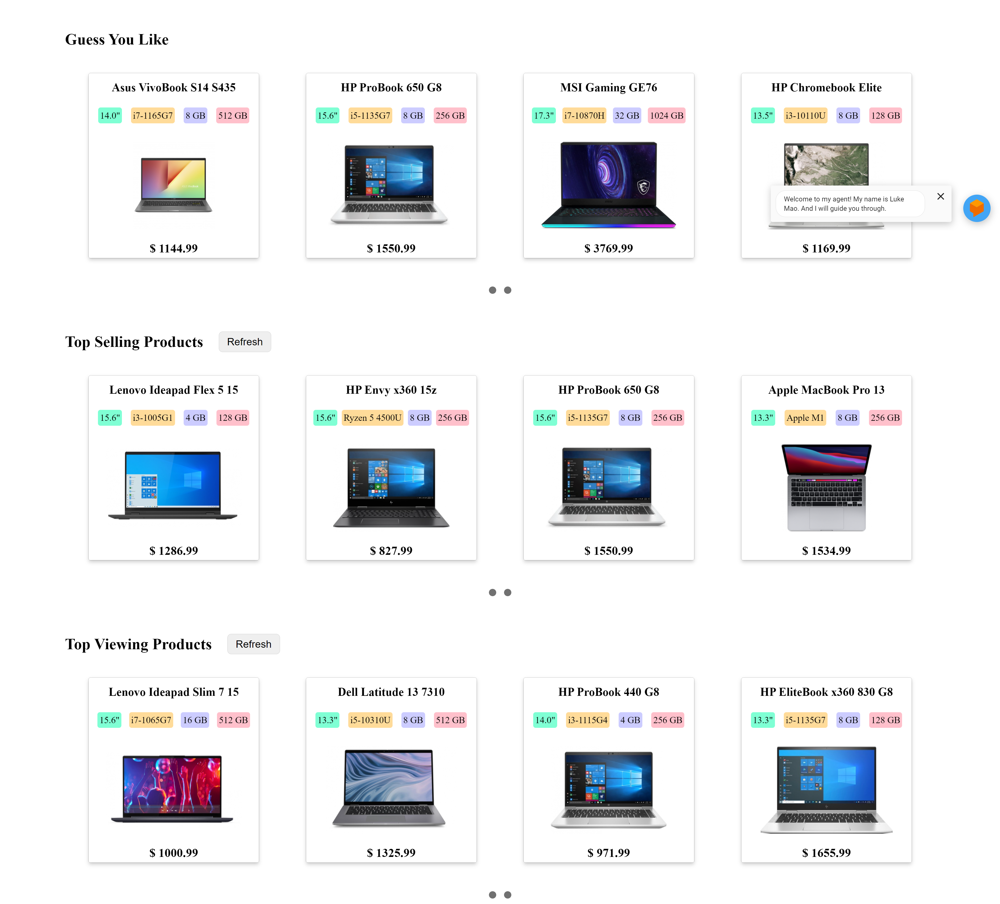
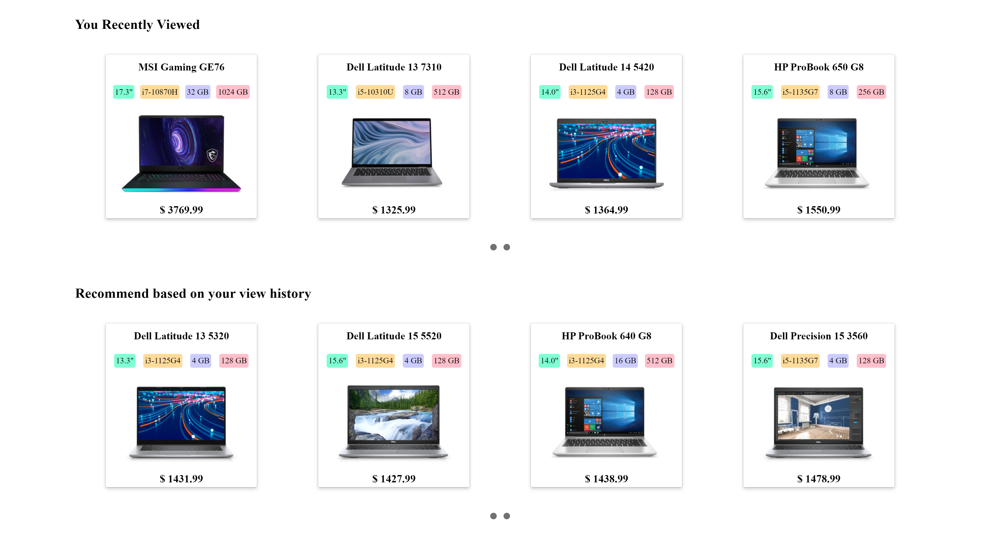
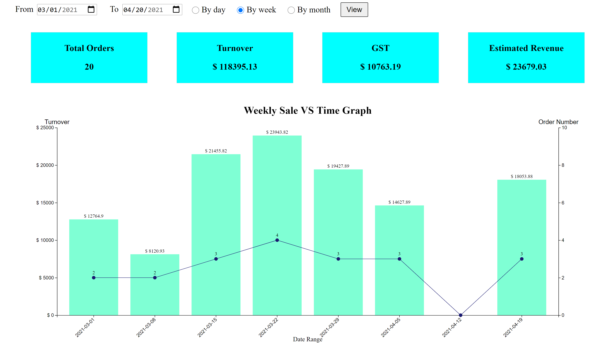

# WWCD5 E-Commerce Laptop Website


[](https://img.shields.io/badge/language-Python3-red)
[](https://img.shields.io/badge/language-JavaScript-red)

## Introduction

This project follows the requirement and guideline of COMP9900 20T1 UNSW. Our topic is to build an E-commerce website for customers to purchase laptops. 

>The business-to-consumer aspect of electronic commerce (e-commerce) is the most visible business use of the World Wide Web. The primary goal of an e-commerce site is to sell goods and services online. This project deals with developing an e-commerce website. It provides the user with a catalog of different products available for purchase in the online store. It must also include a recommender system that helps a user/customer which product to purchase. There are two entities who will have access to the system. One is the admin and the other one is the registered user. In addition, a chatbot should also be included to provide better user interaction. 

## Installation

The project is tested upon the following platforms:

* WIN10 1904
* Linux: 
    * Ubuntu 18.04.5 LTS  
    * Debian GNU/Linux 6.0.10 (UNSW VLAB)

Preferred Python version: Python 3.6, 3.7, 3.8. \
Preferred browser: Chrome version >= 89.

1. Fork / clone / download this repo. Please copy the code into the command window.

    ```
    # use SSH
    git clone git@github.com:unsw-cse-comp3900-9900-21T1/capstone-project-9900-f16a-wwcd5.git

    # use HTTPS (You may be required to sign in by the git crediential manager)
    git clone https://github.com/unsw-cse-comp3900-9900-21T1/capstone-project-9900-f16a-wwcd5.git
    ```

2. Navigate to the directory. 

    `cd capstone-project-9900-f16a-wwcd5`

3. Start the backend.

    ```
    # Enter the backend folder
    cd backend

    # Install all packages.
    pip install -r requirements.txt     # WIN10
    sudo pip3 install -r requirements.txt    # Linux

    # start the backend 
    python app.py                       # WIN10
    python3 app.py                      # Linux
    ```

    You will see the following information in the command window / terminal indicating successful launch.
    ```
    * Serving Flask app "app" (lazy loading)
    * Environment: production
    WARNING: Do not use the development server in a production environment.
    Use a production WSGI server instead.
    * Debug mode: on
    * Restarting with stat
    * Debugger is active!
    * Debugger PIN: 198-113-084
    * Running on http://127.0.0.1:5000/ (Press CTRL+C to quit)
    ```

    Press CTRL+C to quit. 

4. Open a new command window (WIN10) or terminal (Linux) and start the frontend. 

    ```
    # In the new window enter the project folder
    cd capstone-project-9900-f16a-wwcd5

    # Enter the frontend folder
    cd frontend

    # Start the frontend server.
    python -m http.server               # WIN10
    python3 -m http.server              # Linux
    ```

    You will see the following information in the command window / terminal indicating successful launch.

    `Serving HTTP on 0.0.0.0 port 8000 (http://0.0.0.0:8000/) ...`
    
    Press CTRL+C to quit. 

5. Start the web browser. Chrome is the preferred brower. Please clear all cache before browsing. Click on [this link](https://support.google.com/accounts/answer/32050?co=GENIE.Platform%3DDesktop&hl=en) to follow the steps. 

    Enter [localhost:8000](localhost:8000) to visit the frontend. \
    Enter [localhost:5000](localhost:5000) to visit the backend. 

6. Please keep both command windows / terminals on while browsing. Here is a list of accounts you could try.

    | Account Type | Email | Password |
    | ------------ | ------| -------- |
    | Customer | jinjie.mao@mail.com | 111111 |
    | Customer2 | gaoxiang.ren@mail.com | 111111 |
    |Admin |admin@mail.com | 111111 | 

7. If you would like to view the database file, please visit the [SQLite online studio](https://sqliteonline.com/) and select the file `backend/data.db`.


## Highlights

* Purchase snapshot


* View history & Recommenders



* Chatbot
require a photo !!!!!!!


* Sales report using D3.js



## Team Member

Jinjie Mao, Gaoxiang Ren, Yanchao Liu, Zekai Dong, Zhaoyu Li, 


